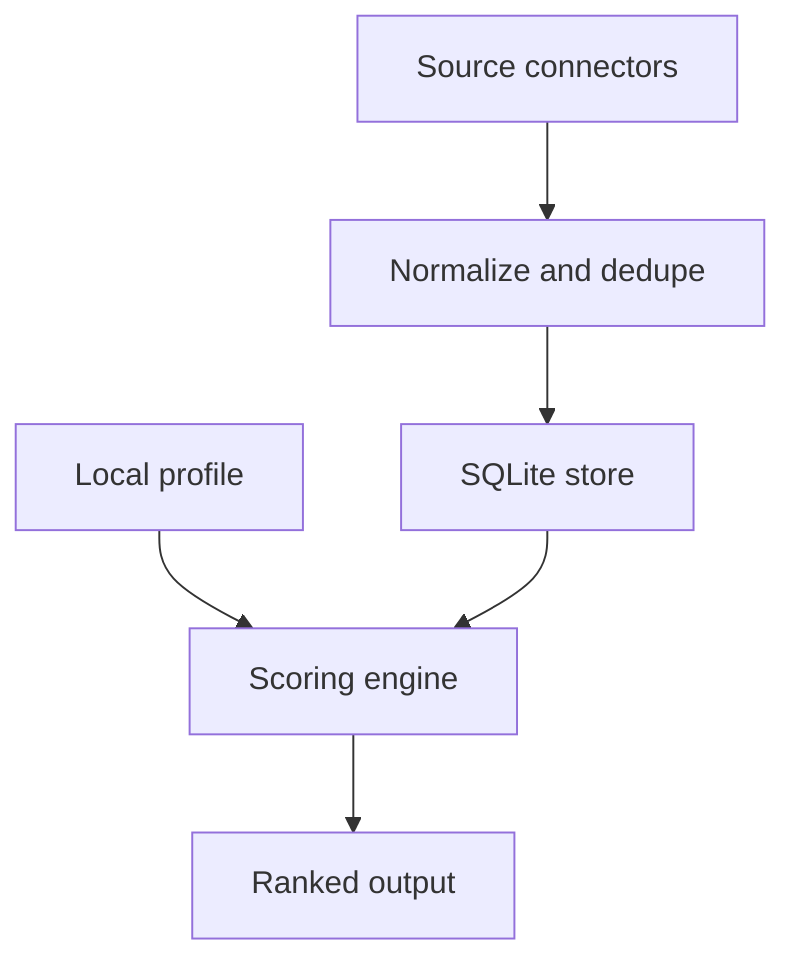

## adr_001_mvp_outil_local_de_veille_et_scoring_d_offres_d_emploi - MVP outil local de veille et scoring d'offres d'emploi
> Date: 2026-06-23
> Status: Accepted
> Related request: `req_000_mvp_job_reviewer`
> Related backlog: `item_001_mvp_outil_local_de_veille_et_scoring_d_offres_d_emploi`
> Related task: (none yet)
> Drivers: local-first data, API-first provider, repeatable runs, replaceable connectors, explainable scoring, future document generation
> Reminder: Update status, linked refs, decision rationale, consequences, and follow-up work when you edit this doc.

# Overview
This ADR captures the initial technical direction for a local job-offer review assistant that ingests configured sources, deduplicates seen offers, scores new offers against a local profile, and produces an explainable shortlist.

# Context
- The user wants a local algorithm that runs on demand and persists every encountered offer to avoid repeated analysis.
- Target sources include LinkedIn, Welcome to the Jungle and Indeed, but those platforms can change markup, restrict automated scraping, and require careful connector boundaries.
- Current public documentation suggests no equally simple open job-search API across the three. Welcome to the Jungle has documented API surfaces that may require token or partnership; Indeed and LinkedIn expose strongly partner-oriented APIs for posting, sync or talent integrations rather than a simple public candidate-side search API.
- The MVP must support future CV and cover-letter generation without implementing that generation now.
- The project starts from an empty repository, so the architecture should be simple, testable and easy to evolve.

# Drivers
- Keep all user data local by default.
- Avoid reprocessing unchanged offers across runs.
- Prefer direct API access when officially available, without relying on manual exports as the product path.
- Make source integrations replaceable because platform pages, APIs and policies change.
- Keep scoring explainable enough for the user to trust and tune it.
- Preserve stored offer context for later CV and cover-letter generation.

# Decision
- Use a local Python CLI as the first runtime surface.
- Use SQLite as the canonical local database for offers, source observations, analysis runs and scores.
- Store the user profile as a local versionable config file, with YAML preferred initially for readability.
- Start with one provider connector only. Candidate: Welcome to the Jungle, pending API/token feasibility; fallback: public-page ingestion for the same provider if compliant and technically stable.
- Split the pipeline into four boundaries:
  - source connectors that discover or load offer URLs/content;
  - normalization and deduplication that produce stable offer records;
  - scoring that compares an offer with the profile and emits explainable reasons;
  - presentation that renders the ranked shortlist.
- Deduplicate by canonical URL when possible, source-specific external ID when available, and content fingerprint as a fallback.
- Treat platform-specific ingestion as replaceable adapters, not as core domain logic.
- Apply location gating before ranking: Paris intramuros, full remote, or substantial-remote hybrid is mandatory.
- Treat salary as optional metadata rather than a primary score dimension.
- Generate XLSX as the primary persisted review artifact and console output as the immediate operator feedback.
- Use the CV-derived profile spec as the initial search and scoring seed, without storing private contact data in the public repo.
- Include a rescore capability in the architecture so historical offers can be rescored after the profile/scoring model improves.

# Consequences
- The first implementation can be useful with a simple source adapter such as a file of URLs or saved HTML before robust platform adapters exist.
- If official API access is unavailable, the provider connector may need a public-page ingestion adapter, a third-party data API, or a later provider switch.
- SQLite keeps setup lightweight and makes repeated local runs deterministic.
- XLSX output adds a small dependency but matches the target review workflow better than CSV alone.
- Future generation of CV and cover letters can use stored offer text, extracted requirements, scoring reasons and selected document template metadata.
- Platform adapters can fail or require maintenance without corrupting the database or scoring model.
- If richer semantic matching is added later, it can be introduced behind the scoring boundary without changing ingestion.

# Alternatives considered
- Manual export as the product source path: rejected because the requested workflow should collect from provider surfaces directly.
- Browser automation as the core: rejected for the core MVP unless provider API access is not available, because it makes the first slice fragile and platform-dependent.
- Cloud database or hosted worker: rejected because the requested workflow is local and on-demand.
- LLM-only ranking without deterministic features: rejected for MVP because the user needs reproducible, explainable comparisons and cost control.

# Follow-up work
- Define the first source adapter contract and pick the first supported ingestion mode.
- Define the SQLite schema and migration strategy.
- Define the initial profile schema and scoring rubric.
- Add tests for deduplication and scoring explanations.

# References
- Related request: `req_000_mvp_job_reviewer`
- Related backlog: `item_001_mvp_outil_local_de_veille_et_scoring_d_offres_d_emploi`
- Related task: (none yet)
