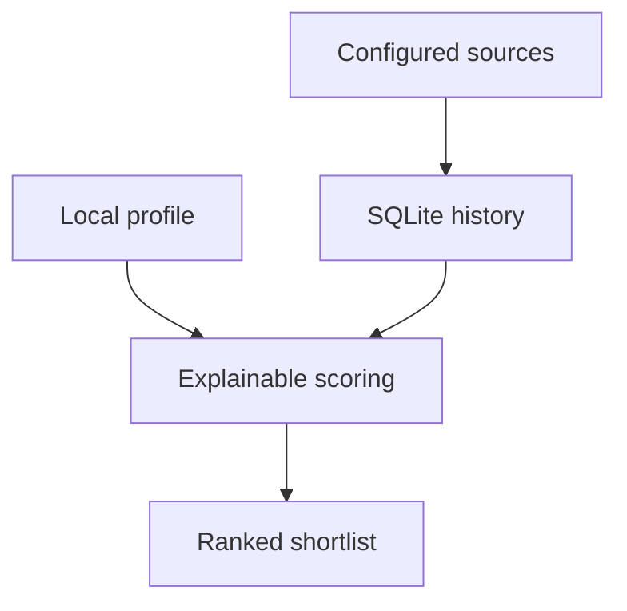

## prod_001_mvp_outil_local_de_veille_et_scoring_d_offres_d_emploi - MVP outil local de veille et scoring d'offres d'emploi
> Date: 2026-06-23
> Status: Accepted
> Related request: `req_000_mvp_job_reviewer`
> Related backlog: `item_001_mvp_outil_local_de_veille_et_scoring_d_offres_d_emploi`
> Related task: `task_001_mvp_outil_local_de_veille_et_scoring_d_offres_d_emploi`
> Related architecture: `adr_001_mvp_outil_local_de_veille_et_scoring_d_offres_d_emploi`
> Reminder: Update status, linked refs, scope, decisions, success signals, and open questions when you edit this doc.

# Overview
Le produit est un assistant local de veille d'offres d'emploi. Il aide l'utilisateur a concentrer son temps sur les annonces les plus proches de son profil, en memorisant ce qui a deja ete vu et en expliquant les ecarts entre une offre et ses competences, envies et contraintes.

# Goals
- Reduire le temps passe a relire les memes offres sur plusieurs plateformes.
- Identifier rapidement les offres les plus pertinentes avec des raisons lisibles.
- Conserver un historique local des offres vues, analysees et ignorees.
- Poser une base de donnees exploitable pour une phase ulterieure de CV et lettre adaptes.
- Demarrer avec un seul provider pour prouver le pipeline avant d'etendre a LinkedIn, Welcome to the Jungle et Indeed.

# Non-goals
- Postuler automatiquement.
- Se connecter a des comptes personnels ou contourner les limitations des plateformes.
- Dependre d'un export manuel comme source produit principale.
- Generer le CV ou la lettre de motivation dans le MVP.
- Remplacer le jugement utilisateur par une decision automatique.
- Fournir une interface graphique dans la premiere version.

# Scope and guardrails
- In: CLI locale, provider initial configure, profil utilisateur local derive d'un CV, base SQLite, deduplication, analyse des nouvelles offres, classement interpretable.
- In: modele de donnees preservant titre, entreprise, localisation, remote, salaire si disponible, description, URL, source, empreinte de contenu, score, raisons et ecarts.
- Out: automatisation de candidature, scraping authentifie, orchestration cloud, synchronisation multi-utilisateur.
- Guardrail: l'outil doit documenter clairement que chaque connecteur depend des conditions et contraintes de la source cible.

# Key product decisions
- Le MVP est local-first: donnees et profil restent sur la machine de l'utilisateur.
- Le MVP est provider-first: un seul provider initial, probablement Welcome to the Jungle si l'acces API ou pages publiques est viable.
- Le premier scoring doit etre interpretable avant d'etre intelligent: une heuristique transparente est acceptable si elle expose ses raisons.
- La localisation est un critere bloquant: Paris intramuros, full remote, ou hybride hors Paris avec teletravail substantiel.
- Le top initial conserve 5 offres, puis les seuils seront calibres avec l'usage.
- Les connecteurs de sources sont des modules remplacables, car LinkedIn, Welcome to the Jungle et Indeed changent leurs pages et politiques.
- Les offres deja vues restent visibles dans la base mais ne sont pas reanalysees tant que leur empreinte ne change pas.
- La sortie initiale combine retour console et fichier XLSX.
- Les informations personnelles de contact extraites du CV ne doivent pas etre versionnees dans le depot public.

# Success signals
- Une execution consecutive sans nouvelle offre ne retraite rien.
- Une nouvelle offre pertinente apparait dans le top avec des raisons comprehensibles.
- Une offre hors Paris/full remote/substantial-remote hybrid est exclue ou marquee non eligible avant le top.
- Une offre faible est classee bas avec les ecarts principaux visibles.
- Ajouter une nouvelle source ne demande pas de modifier le stockage ni le scoring.
- Les donnees stockees suffisent a alimenter plus tard un brouillon de CV ou lettre.

# Primary user workflow
- L'utilisateur met a jour son profil local.
- L'utilisateur configure ou fournit des sources d'offres.
- L'utilisateur lance la commande de collecte/analyse.
- L'outil enregistre les offres inconnues, ignore les doublons et analyse les nouveautes.
- L'utilisateur consulte le top et decide quelles offres approfondir.

# Open questions
- Quel format de profil initial est le plus pratique: YAML simple, JSON ou import depuis un CV existant?
- Le premier provider doit-il etre confirme comme Welcome to the Jungle, ou une API tierce rend-elle Indeed/LinkedIn plus simple en pratique?
- Quel seuil exact definit le teletravail substantiel: 3 jours/semaine, 60%, ou texte explicite "mostly remote"?
- Quels roles derives du CV doivent etre prioritaires dans la premiere collecte?
- Le scoring doit-il favoriser les competences actuelles, les competences a developper, ou un mix configurable?
- La generation future doit-elle garder PPT/Word comme cible ou adopter un format intermediaire plus modulaire?

# References
- Product back-reference: `item_001_mvp_outil_local_de_veille_et_scoring_d_offres_d_emploi`
- Task back-reference: `task_001_mvp_outil_local_de_veille_et_scoring_d_offres_d_emploi`
